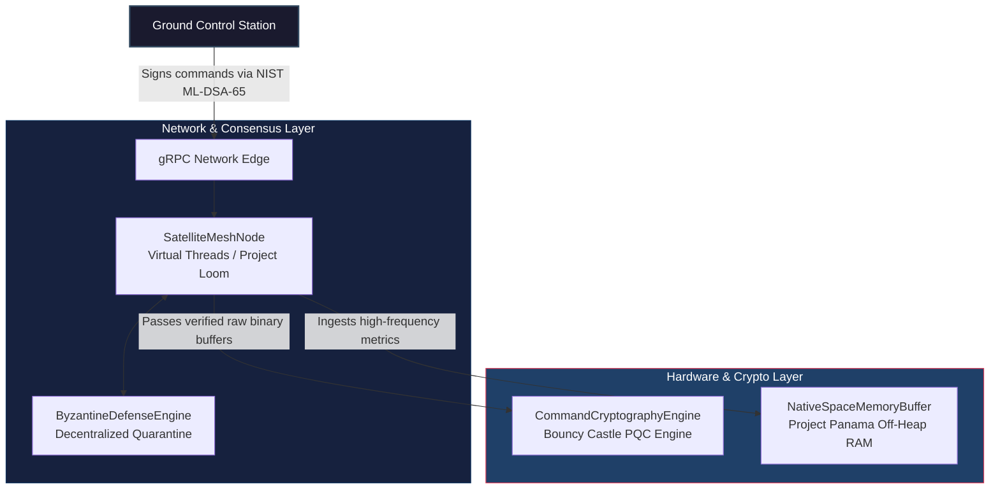

# 🌌 Quant-Orbital (quant-orbital)

**Quant-Orbital** is a next-generation, post-quantum cryptographic (PQC) security mesh and telemetry verification system designed for distributed satellite constellations. Operating at the intersection of aerospace software engineering and quantum-resistant cryptography, this system safeguards satellite command pipelines (`uplink`) against quantum-computing adversaries while ensuring deterministic, zero-allocation memory footprints on edge-side space hardware.

---

## 🏗️ System Architecture

The project is built using a decoupled, highly cohesive **Maven Multi-Module Architecture** optimized for resource-constrained embedded environments via **GraalVM Native Image Compilation**.



### 🛠️ Core Technology Stack & Architectural Highlights

1. **`quant-orbital-core` (Post-Quantum Cryptography & Hardware Memory)**
   * **NIST ML-DSA (CRYSTALS-Dilithium65):** Implemented via Bouncy Castle PQC API. Protects critical maneuvers from algorithmic break-ins by future quantum computers.
   * **Project Panama (Foreign Function & Memory API):** Bypasses standard JVM Garbage Collection completely. Telemetry matrices are written directly into off-heap native memory segments (`Arena.ofShared()`), ensuring microsecond-level determinism and avoiding JVM `OutOfMemoryError` states.
   * **Data Invariance:** Utilizing **Java Records** to guarantee read-only immutability of space commands, eliminating data corruption risks during thread execution.

2. **`quant-orbital-mesh` (Distributed Actor Mesh & Consensus)**
   * **Project Loom (Virtual Threads):** Spawns ultra-lightweight virtual threads per constellation socket connection, lifting the constraints of expensive OS platform threads.
   * **Byzantine Fault Tolerance (BFT):** Implements an in-memory decentralized node voting policy `N >= 3f + 1`. If an orbital node is compromised or hit by severe space radiation, peer nodes autonomously achieve consensus to quarantine the corrupted entity.
   * **High-Performance gRPC / Protobuf:** Replaces heavy text-based JSON footprints with ultra-dense, optimized raw binary protocols over multiplexed HTTP/2 streams.

3. **`quant-orbital-simulator` (Real-Time Uplink & Cyber Attack Vectors)**
   * Simulates legitimate ground telemetry ingestion alongside a simulated **Quantum-Powered Man-In-The-Middle (MITM) signature injection attack** to demonstrate real-time defensive trigger switches.

---

## 📂 Project Repository Structure

```text
quant-orbital/
├── .github/workflows/
│   └── build-native.yml          # GraalVM automated CI/CD build configuration
├── quant-orbital-core/           # Cryptographic primitives, Records, and Off-Heap Buffer
├── quant-orbital-mesh/           # gRPC Service Layer, Protobuf schemas, and BFT Engine
└── quant-orbital-simulator/      # Operational simulation orchestration suite
```

---

## 🚀 Building and Running the Pipeline

### Prerequisites
* **Java SDK 21 or higher** (GraalVM Community Edition heavily recommended)
* **Apache Maven 3.9+**

### Step 1: Clone the Repository
```bash
git clone https://github.com/yagizyagli/quant-orbital
cd quant-orbital
```

### Step 2: Compile & Run Simulation
Compile all independent sub-modules and run the end-to-end mission verification workflow:
```bash
mvn clean install
mvn exec:java -pl quant-orbital-simulator -Dexec.mainClass="com.quantorbital.simulator.EngineSimulatorApplication"
```

### Step 3: Compiling to Native Image (Zero-JVM Flight Mode)
To generate stand-alone native execution binaries stripped of JVM overhead:
```bash
mvn package -Pnative
```

---

## 🌟 Support the Research

If you find this repository valuable for understanding **Post-Quantum Cryptography (PQC)**, **Advanced Java Concurrency (Loom)**, or **Low-Level Native Memory Access (Panama)** in Aerospace systems, **please drop a star!** 

Your star drives continuous optimization updates to this repository. ⭐

---

## 👤 Author

* **Yağız Yağlı** - [@yagizyagli](https://github.com/yagizyagli)
* **Live Demo** -   [@quant-orbital](https://yagizyagli.github.io/quant-orbital/)

---

## 📄 License

**Apache License 2.0** 
